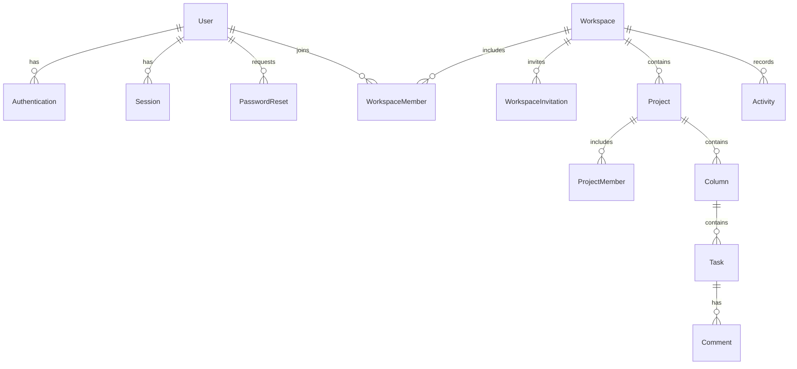

# DevFlow AI

A developer workspace for organizing projects, collaborating on Kanban boards, and drafting plans with AI assistance. Built as a pnpm monorepo with a Next.js frontend and an Express/PostgreSQL backend.

## What is implemented

| Area           | Features                                                                                                                        |
| -------------- | ------------------------------------------------------------------------------------------------------------------------------- |
| Authentication | Email or mobile signup/login, cookie sessions, rotating refresh tokens, logout, email password recovery, single-use reset links |
| Dashboard      | Workspace/project overview, task statistics, recent tasks, recent activity                                                      |
| Workspaces     | Create/edit/delete, invitation links, members, owner/admin/member permissions                                                   |
| Projects       | Create/edit/delete, project membership, an individual Kanban board for each project                                             |
| Kanban         | Custom columns, completed-column status, task drag and drop, explicit move controls, persistent ordering                        |
| Tasks          | Title, description, due date, priority, labels, assignee, comments, status through board columns                                |
| Planning       | Subtask suggestions, project summaries, sprint plans, personal standups; local planner or optional OpenAI provider              |
| Foundation     | Validated configuration, migrations, structured logs, request limits, origin checks, tests, production builds                   |

Email verification is intentionally deferred. Workspace invitations are copyable links: the administrator shares the generated link. Password recovery uses the separate email integration described below.

## Run locally

Requirements: **Node 22**, **pnpm 10**, and PostgreSQL. Docker is optional if you already have PostgreSQL.

```sh
nvm use
pnpm install --frozen-lockfile
```

If pnpm is missing, enable it with Corepack or install pnpm 10 using your normal Node package setup. Run the following commands from the repository root.

1. Start a database. Compose uses port **5433** to avoid replacing an existing service on 5432:

   ```sh
   docker compose up -d --wait postgres
   ```

2. Create configuration files **only if they do not exist**:

   ```sh
   cp -n apps/server/.env.example apps/server/.env
   cp -n apps/web/.env.example apps/web/.env.local
   ```

   The example database URL matches Compose. For an existing database, keep its current `DATABASE_URL`. Replace both JWT secret placeholders with independent random values of at least 32 characters. Generate each with:

   ```sh
   node -e "process.stdout.write(require('node:crypto').randomBytes(48).toString('hex') + '\n')"
   ```

3. Generate Prisma and apply migrations:

   ```sh
   pnpm db:generate
   pnpm db:migrate
   ```

4. Start both apps:

   ```sh
   pnpm dev
   ```

Open [localhost:3000](http://localhost:3000). The API runs on [localhost:5001](http://localhost:5001); its [health endpoint](http://localhost:5001/health) checks that the API is running. Signup creates your account and logs you in. Create a workspace, a project, and your first task. No shared default administrator account/password is installed.

Use `localhost` consistently for both apps: changing one app to `127.0.0.1` affects cookies and origins.

The development frontend explicitly uses port 3000. If that port is occupied, stop the previous frontend instead of silently opening another port. For an intentional additional frontend, add its exact origin to `CORS_ORIGINS` in the API environment and restart the API; for example, `CORS_ORIGINS=http://localhost:2000`. This allowlist is shared by CORS and the browser-write protection. It does not change the main frontend URL or password-recovery links.

## Commands

| Command                             | Purpose                                                      |
| ----------------------------------- | ------------------------------------------------------------ |
| `pnpm dev`                          | Start web and API together                                   |
| `pnpm dev:web` / `pnpm dev:server`  | Start one app                                                |
| `pnpm build`                        | Compile backend and build frontend                           |
| `pnpm build:production`             | Generate Prisma and build both apps for hosting              |
| `pnpm start:production`             | Serve the built frontend and API together                    |
| `pnpm build:vercel`                 | Build the Vercel release and migrate its production database |
| `pnpm lint`                         | Frontend ESLint checks                                       |
| `pnpm format` / `pnpm format:check` | Format source files / verify formatting                      |
| `pnpm test`                         | Regression tests with mocked database/provider boundaries    |
| `pnpm test:integration`             | Full HTTP workflow against configured PostgreSQL             |
| `pnpm db:generate`                  | Regenerate Prisma client/types                               |
| `pnpm db:migrate`                   | Apply committed migrations without resetting data            |
| `pnpm db:studio`                    | Open Prisma Studio                                           |

The integration suite creates uniquely named users/workspaces and removes only those fixtures in cleanup. It mocks email and never calls a paid AI service. Use a development/test database. To generate a migration during development: `pnpm --filter server prisma:migrate --name your_change`.

## Configuration

Backend: `apps/server/.env`. Frontend: `apps/web/.env.local`. Examples are committed; real configuration and mail previews are ignored by Git.

| Variable                          | Meaning                                                                                    |
| --------------------------------- | ------------------------------------------------------------------------------------------ |
| `NODE_ENV`                        | `development`, `test`, or `production`                                                     |
| `PORT`                            | Optional API port, default `5001`; omit or set a valid integer from 1 to 65535             |
| `DATABASE_URL`                    | PostgreSQL connection string                                                               |
| `WEB_URL`                         | Frontend origin and recovery link base, default `http://localhost:3000`                    |
| `CORS_ORIGINS`                    | Optional comma-separated additional trusted HTTP(S) origins; no wildcards or URL paths     |
| `JWT_ACCESS_SECRET`               | Signs short-lived access JWTs                                                              |
| `JWT_REFRESH_SECRET`              | Independent secret hashing opaque refresh credentials                                      |
| `ACCESS_TOKEN_EXPIRY`             | Default `15m`, positive duration up to one day                                             |
| `REFRESH_TOKEN_EXPIRY`            | Default `7d`, positive duration up to 90 days                                              |
| `API_COOKIE_SECURE`               | Optional secure cookies in development; production always uses Secure                      |
| `AI_MODE`                         | `local` (default) or `provider`                                                            |
| `OPENAI_API_KEY` / `OPENAI_MODEL` | Both required in provider mode; server-only                                                |
| `RESEND_API_KEY` / `MAIL_FROM`    | Production recovery-email credentials and verified sender                                  |
| `MAIL_PREVIEW_DIR`                | Optional local email directory override                                                    |
| `NEXT_PUBLIC_API_URL`             | Browser API base, default `/api` (same origin)                                             |
| `API_INTERNAL_URL`                | Local development rewrite target, default `http://127.0.0.1:5001`                          |
| `TRUST_VERCEL_PROXY`              | Opt-in to Vercel's client-IP header; requires production mode and Vercel's platform flag   |
| `DIRECT_URL`                      | Optional migration override; Supabase shared pooler URLs can derive the session connection |

`NEXT_PUBLIC_API_URL` is embedded in the frontend build; set it before building for deployment.

`PORT`, `ACCESS_TOKEN_EXPIRY`, and `REFRESH_TOKEN_EXPIRY` must be absent or contain valid values. Empty strings do not select their defaults and prevent the API from starting. Use `PORT=5001`, `ACCESS_TOKEN_EXPIRY=15m`, and `REFRESH_TOKEN_EXPIRY=7d`, or remove those variables to use the defaults. This validation also runs inside the hosted API function, even though Vercel manages its HTTP listener.

### Password recovery

In development/tests, emails are saved as private JSON files in **`apps/server/.local/mail/`**. Request a reset for a registered email, then open the newest file and follow its link. Tokens are never returned by the API or printed in API logs. They expire in 30 minutes, can be used once, and changing a password revokes existing sessions.

In production, configure `RESEND_API_KEY` and a verified `MAIL_FROM`. The mailer uses the [Resend email API](https://resend.com/docs/api-reference/emails/send-email). Failed delivery invalidates the token and logs a generic error. Known and unknown accounts receive the same HTTP response. Mobile-only accounts currently have no SMS recovery flow.

### Local planner and AI provider

The app works without an AI key. **Local mode is deterministic planning, not a language model**: it suggests acceptance/implementation/verification tasks, calculates project progress, prioritizes unfinished tasks by priority/due date, and assembles standups from your assigned tasks.

For OpenAI, set `AI_MODE=provider`, provide a key and a model available to your account that supports Responses structured outputs, then restart the API. The implementation uses the [Responses API with structured outputs](https://developers.openai.com/api/docs/guides/structured-outputs), disables response storage, validates results with Zod, and times out after 30 seconds. Provider failures return a safe error rather than silently switching engines.

Generation sends selected task/project context to OpenAI only when requested. It excludes credentials, member emails, and comments. Analysis considers at most 200 recently updated tasks; partial project summaries are labeled. Sprint capacity is a **task count**, not hours or story points. Standups use assigned tasks and update timestamps for recent completions. Suggestions are previews; adding suggested subtasks is a separate action that creates regular board tasks referencing the original task in their descriptions.

Provider responses/failures are tested through a mocked HTTP boundary. Live AI calls and real email delivery require your provider configuration and were not used for local verification.

## Understand the code

```text
apps/
  web/                    Next.js screens, API client, reusable UI
  server/
    prisma/
      schema.prisma       Models and relationships
      migrations/         Auth, workspace, and database-access migrations
    src/
      config/             Environment validation
      lib/                Prisma, mail, database types
      middlewares/        Validation, session authentication, security
      modules/
        auth/             Accounts, sessions, password recovery
        workspaces/       Workspaces, invitations, roles
        projects/         Projects, members, board columns
        tasks/            Tasks, ordering, assignees, comments
        dashboard/        Access-filtered overview/activity
        ai/               Local planner and provider integration
      shared/             Authorization, errors, logging, responses
      app.ts              Express middleware/route composition
      server.ts           Startup, DB connection, shutdown
    tests/                HTTP, security, planner, domain, integration
compose.yaml              Optional local PostgreSQL
```

### Request flow and layer responsibilities

```text
Browser → Route → Validation → Controller → Service → Repository → Prisma → PostgreSQL
```

Routes compose middleware. Zod checks input. Controllers translate service results into HTTP status codes and `ApiResponse`. Services make authentication, permission, and transaction decisions. Repositories accept `PrismaClientOrTransaction`, so methods work inside or outside transactions without importing a singleton. Shared authorization helpers centralize membership checks across features.

Frontend styles use a CSS Module beside each component. Shared controls and layout primitives are composed explicitly from `apps/web/src/components/shared.module.css`; only document defaults and theme variables remain global. See the [frontend styling guide](apps/web/README.md#styling-safely) for where to make local changes without affecting other screens.

For example, moving a task checks project access and the destination column, rejects cross-project moves, then updates ordering transactionally. Per-project database row locks serialize concurrent board mutations. The controller only returns the result.

### Database design



`User` remains a profile. Provider identifiers/password hashes remain in `Authentication`, preserving the existing design for future providers without email/mobile columns on User. New tables extend this design; migrations preserve existing users/authentications.

Each project has one board with **To do / In progress / Done** columns initially. `Column.isDone` defines completion even if the column is renamed. Task status is its column, avoiding a second field that could disagree with the board.

### Permissions

| Action                                           | Owner               | Admin               | Member                        |
| ------------------------------------------------ | ------------------- | ------------------- | ----------------------------- |
| View workspace and member list                   | Yes                 | Yes                 | Yes                           |
| Edit workspace / invite / manage non-owner roles | Yes                 | Yes                 | No                            |
| Remove/demote owner                              | No                  | No                  | No                            |
| Delete workspace                                 | Yes                 | No                  | No                            |
| Create project                                   | Yes                 | Yes                 | Yes                           |
| Access project                                   | All in workspace    | All in workspace    | Projects they belong to       |
| Manage project/settings/columns/members          | Yes                 | Yes                 | Creator, while still a member |
| Create/edit/move/delete tasks                    | Accessible projects | Accessible projects | Accessible projects           |
| Delete comment                                   | Yes                 | Yes                 | Own comment                   |

Invitation tokens are random, expire in seven days, are stored as hashes, and require an account matching the invited email. Accepting an invite does not upgrade an existing member's role. Removing a workspace member removes their project memberships and clears task assignments there. API checks enforce permissions; hiding buttons is not authorization.

### Authentication decisions

Passwords use bcrypt with a 72-byte maximum to avoid silent truncation. Emails are normalized and exactly one identifier is accepted. Unknown accounts, wrong passwords, and inactive accounts receive identical login errors.

Access tokens are short-lived JWTs; refresh tokens are opaque random credentials with hashed server-side session records. HttpOnly, SameSite=Lax cookies keep tokens out of browser JavaScript. Production cookies are Secure. Atomic refresh rotation detects replay. The frontend serializes refresh requests to avoid rotating twice concurrently.

Every authenticated request checks its session in PostgreSQL. Compared with entirely stateless JWTs, this costs a query but makes logout/reset revocation immediate. Login and reset share a user-row lock to prevent an in-flight login creating a session with a password that has just changed.

### API map

Paths below are under `/api`. Domain routes require an active session. Successful responses are `{ success: true, message, data }`; validation failures include `errors`.

| Resource          | Endpoints                                                                                                                                     |
| ----------------- | --------------------------------------------------------------------------------------------------------------------------------------------- |
| Auth              | `POST /auth/register`, `/auth/login`, `/auth/refresh`, `/auth/logout`, `/auth/forgot-password`, `/auth/reset-password`; `GET /auth/me`        |
| Workspaces        | `GET/POST /workspaces`; `GET/PATCH/DELETE /workspaces/:id`                                                                                    |
| Workspace members | `GET /workspaces/:id/members`; `PATCH/DELETE /workspaces/:id/members/:userId`; `POST /workspaces/:id/invitations`; `POST /invitations/accept` |
| Projects          | `GET/POST /workspaces/:workspaceId/projects`; `GET/PATCH/DELETE /projects/:id`                                                                |
| Project members   | `GET/POST /projects/:id/members`; `DELETE /projects/:id/members/:userId`                                                                      |
| Columns           | `POST /projects/:projectId/columns`; `PATCH/DELETE /columns/:id`                                                                              |
| Tasks             | `GET/POST /projects/:projectId/tasks`; `GET/PATCH/DELETE /tasks/:id`; `PATCH /tasks/:id/move`                                                 |
| Comments          | `GET/POST /tasks/:id/comments`; `DELETE /comments/:id`                                                                                        |
| Dashboard         | `GET /dashboard`, optional `workspaceId` query                                                                                                |
| Planning          | `GET /ai/status`; `POST /ai/subtasks`, `/ai/project-summary`, `/ai/sprint-plan`, `/ai/standup`                                                |

Task creation: `{ title, description?, columnId, priority?, dueDate?, labels?, assigneeId? }`. Priorities: `LOW`, `MEDIUM`, `HIGH`, `URGENT`. Move: `{ columnId, position }`. Subtasks: `{ taskId }`. Summary: `{ projectId }`. Sprint: `{ projectId, goal?, capacity? }`. Standup: `{ workspaceId, date? }`.

## What changed

The repository began with registration/login APIs, an auth schema, a Next.js starter screen, and an architecture sketch. It now contains the application above, additive migrations, integrated UI, recovery/session flows, permission checks, planning tools, configuration examples, and repeatable verification commands.

Production startup was repaired by replacing unresolved TypeScript `@/` imports with relative imports. The API validates configuration and connects to PostgreSQL before listening. Pino handles logs without exposing tokens/SQL values; graceful shutdown closes HTTP and Prisma. HTTP middleware handles malformed JSON, body limits, unknown routes, browser origins, and rate limits.

### Verification completed

Verified locally on September 24, 2026, with Node 22 and PostgreSQL:

- Production builds for the API and frontend, frontend lint, and formatting checks passed. Next.js 16.3.6 and Prisma 6.19.3 are used; the production dependency audit reports no known vulnerabilities.
- The actual Next production server passed HTTP checks for compiled pages/assets, database readiness, secure cookies, signup, persisted projects/tasks, task movement, session refresh, origin rejection, and logout. The deployment trace includes Prisma and bcrypt Linux binaries.
- `pnpm test`: 106 passed (79 backend, 12 Next/Express bridge, 9 migration guards, 6 production configuration guards); the opt-in database suite is skipped by this command. Includes credentialed CORS preflights, error-response headers, additional configured origins, rejection of untrusted origins, and safe API startup diagnostics.
- `pnpm test:integration`: all 9 checks passed, covering permissions, invitations, task ordering, concurrent moves, planning, refresh/logout, password recovery, and database row-level security against PostgreSQL.
- Browser checks passed for login, workspace/project creation, task fields, comments, persistent drag and drop, all four planning tools, and editing/applying subtask suggestions.
- At a 390-pixel viewport, the dashboard, navigation drawer, board, and task status selector were checked. Changing status updated the board and completion count.

Verification used disposable test accounts and workspaces. Existing account data was preserved. Provider responses and email delivery were mocked; live provider configuration remains a deployment step.

## Production and current boundaries

The app is deployed at [DevFlow AI](https://devflow-ai-web-ten.vercel.app). One Vercel project serves the frontend and backend; Supabase hosts PostgreSQL. The [Vercel deployment guide](docs/DEPLOYMENT.md) explains the configuration and how to deploy updates. The demo uses Vercel Hobby and Supabase Free for personal, non-commercial use.

The Next.js API route delegates to the existing Express backend. The browser uses `/api` on the same HTTPS origin, so cookies work without a separate API domain. `pnpm build:vercel` generates Prisma, compiles the backend, validates API configuration before applying migrations in Vercel Production builds, and builds Next.js. Invalid configuration stops the production build before migrations. `apps/web/vercel.json` sets the deployment commands; choose `apps/web` as the Vercel Root Directory and include files outside that directory.

The existing Vercel project tracks `codex/deploy-vercel`. Create each production deployment from that branch's latest commit and confirm the source commit in Vercel. Redeploying an older `main` deployment rebuilds that older commit and misses the deployment fixes.

`DATABASE_URL` uses a pooled database connection. For production migrations, an explicit `DIRECT_URL` takes priority. When it is missing or empty, the build can derive Supabase's session connection only from a shared `*.pooler.supabase.com:6543` transaction URL, changing the port to `5432` while preserving credentials, database, and TLS settings. Other providers require `DIRECT_URL`; malformed or whitespace-only overrides fail instead of falling back. Production and preview databases/secrets should be separate. Recovery email and paid AI providers remain optional configuration. See the guide for variables, validation, limits, updates, and rollback.
Local accounts and development data were not copied to Supabase. If an account exists only on your machine, use Sign up on the live site. DevFlow keeps its own email/mobile login and session system, with Prisma connecting to Supabase PostgreSQL. The Supabase JavaScript/SSR quickstart is not needed for this configuration.

Current choices: one board per project, link-based invitations, email-only recovery, deferred verification/OAuth, no realtime push updates, attachments, or nested task hierarchy. Rate limits are per-process; Vercel can create multiple function instances, so use a shared limiter before broader public use. Configure backups, monitoring, TLS/proxies, and secret management for your deployment. The API does not trust forwarded IP headers by default.

### Production verification (September 24, 2026)

The deployment startup failure came from invalid Vercel values for `PORT`, both token lifetimes, and both JWT secrets. Production now uses port `5001`, access lifetime `15m`, refresh lifetime `7d`, and independently generated JWT secrets stored only in Vercel. The build validates these settings before running migrations.

Live checks on the production domain passed:

- Login page and compiled frontend assets: HTTP 200.
- `/api/health` and `/api/health/ready`: HTTP 200, including a successful Supabase database query.
- Synthetic email/mobile login attempts: HTTP 401 with the expected invalid-credentials response and no session cookies.
- Invalid registration and malformed JSON: HTTP 400; protected routes without a session: HTTP 401; an untrusted browser origin: HTTP 403.

These live checks created no accounts or application records. The authenticated workspace/task flows were verified locally as described above. Password recovery email and external AI provider delivery remain unconfigured for this demo.

### Troubleshooting

- **Node version error:** run `nvm use` (Node 22).
- **Database unreachable:** confirm the URL/port (Compose 5433; existing installations often 5432).
- **Missing models/tables:** run `pnpm db:generate` and `pnpm db:migrate`.
- **Hosted API returns 500:** inspect Vercel runtime logs for `DevFlow AI API failure.` and its stage. `environment-validation` includes only recognized configuration key names; check those variables, including blank optional values and JWT secrets shorter than 32 characters. The other stages distinguish configuration-module loading, application-module loading, and request handling. Logs omit configuration values, raw errors, stacks, and request data. See the [deployment troubleshooting guide](docs/DEPLOYMENT.md#updates-and-troubleshooting).
- **Unexpected logout/CORS error:** use a consistent hostname and check `NEXT_PUBLIC_API_URL`. The browser's exact origin (scheme, hostname, and port) must match `WEB_URL` or an explicit `CORS_ORIGINS` entry. Restart the API after changing these values. A CORS allowlist does not make cookies work across unrelated sites.
- **Missing local reset email:** check `apps/server/.local/mail/`; the email must be registered.
- **AI provider unavailable:** verify key/model access, or use `AI_MODE=local`.
- **429 response:** respect the retry interval; authentication attempts are rate limited.
